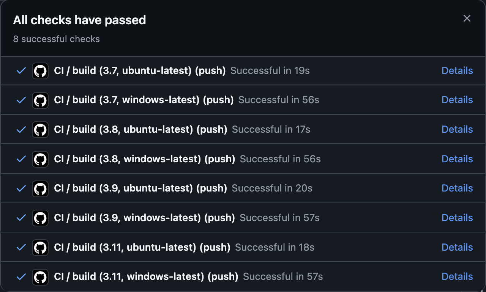

# Nakiyah_Assignment4

## Purpose of this project:
- Set up a Gitlab Actions workflow
- Test across at least 3 different Python versions

## Output:
Python CI Workflow with Matrix Testing Across Multiple Python Versions (3.7, 3.8, 3.9, 3.11) and Operating systems (ubuntu-latest, windows-latest)

## Passing the tests
